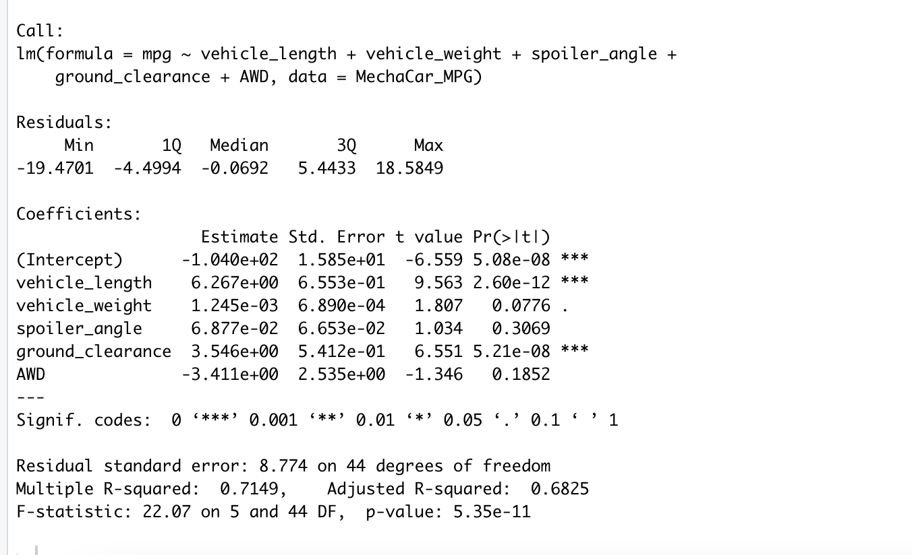
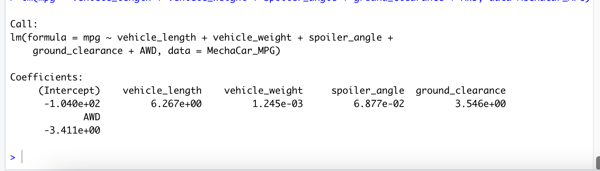
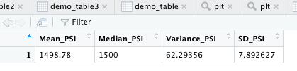
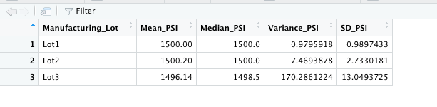
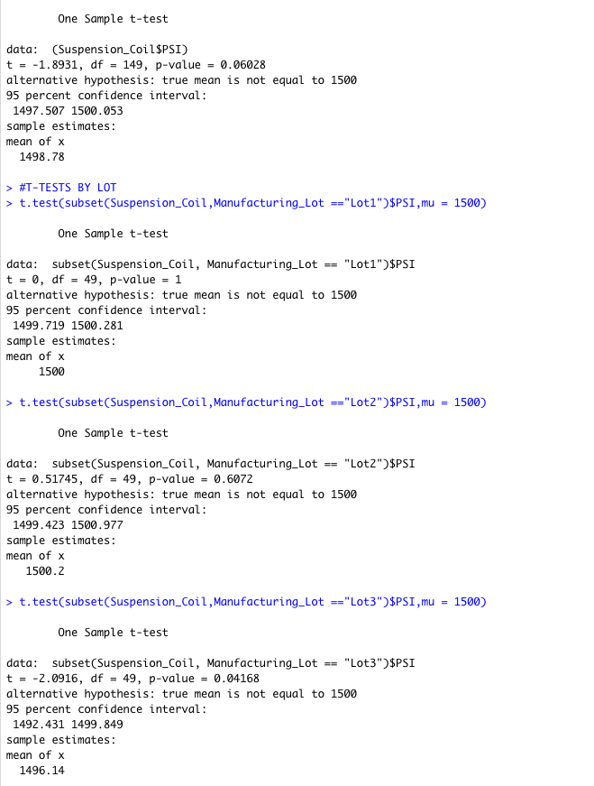

## Linear Regression to Predict MPG 

Vehicle length and ground clearence provided non-random amount of variance to the mpg values in the dataset. The slope of the linear model is not considered to be zero because we can reject the null hypothesis due to the p-value being below the critical threshold. The Adjusted R-Squared of the model indicates 68% of the variance can be predicted by the independent variables. A common critical threshold for strong correlation is 0.7 which we are just short of in our model. I would say our model does a decent job at predicting mpg, but not spectacular. 

## Summary Statistics on Suspension Coils

From the charts above we can conclude that all three manufaturing lots meet the standard of not deviating more than 100 psi variance on the coils. As a whole the standard deviation in psi is 7.8 meaning that three standard deviations (virtually 100%) would be well short exceeding 100 psi variance in manufacture. Any quality control efforts should be directed at Lot 3 since their standard deviation is the highest by a signifigant margin. 

## T-Tests on Suspension Coils 

As you can see from the data above, at 0.05 signifigance level, we can conclude that both the lots and data as a whole population have a p value over 0.025 (two tailed). This would lead us to conclude that the mean is not signifigantly different than 1500. 

## Study Design: MechaCar Vs. Competition

In competition with the rest of the market, a good study would be to determine value vs. the other car models. We can do this by analysing common attributes shoppers look for when purchasing a new vehicle. One of the main factors is reliablilty. We can do a statistical study based on how many repairs happen to the car in the first year. 

1 The metric we are going to test is issues per 100 cars on the road per year. We will gather data for all the cars in the segment and run ANOVA on the different models to determine signifigance. 

2 The null hypothesis would be that there is no signifigant difference between reliability between samples. The alt. hypothesis would be that they are statistically different. 

3 We will use ANOVA testing to determine if the samples from different vehicles are sign. different. 

4 The data needed to run the test would be the number of reported repairs per 100 cars of a particular model in the segment per year. We will use this data to determine whether the cars are actually more reliable than the competition. 

